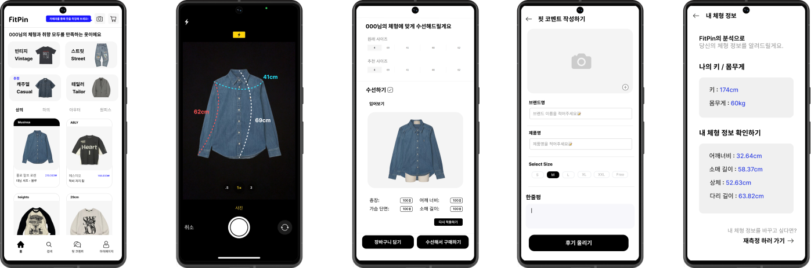

# Fitpin



- Fitpin 앱


## 사용법

1. **개발 환경 설치**

   - [**node.js & npm설치**](https://nodejs.org/en)
   
   - [**Android Studio 설치**](https://developer.android.com/studio?gad_source=1&gclid=CjwKCAiAxea5BhBeEiwAh4t5K2uYb2RMJtf7epeSj27TD3_oIIe3RKgxoxf6m-DChUYkkzNQCBLyYBoCBqsQAvD_BwE&gclsrc=aw.ds&hl=ko)


   - [**JDK17 설치**](https://www.oracle.com/java/technologies/javase/jdk17-archive-downloads.html)

2. **npm 으로 React-Native-Cli 설치**

   ```bash
   npm install -g react-native-cli
   npm install -g react-native
   ```

3. **프로젝트 Clone**

   > 프로젝트 폴더가 한글 경로에 위치 하면은 안됨

   ```bash
   git clone https://github.com/fit-pin/fitpin_frontend_app.git
   ```

5. **Android Emulator 또는 실물 기기 디버그 모드로 연결**

4. **npm 으로 시작**

   ```bash
   npm run android
   ```